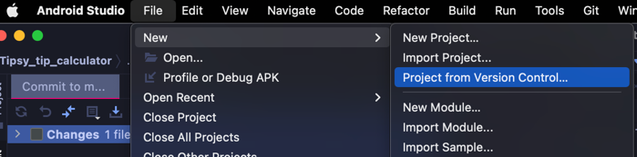
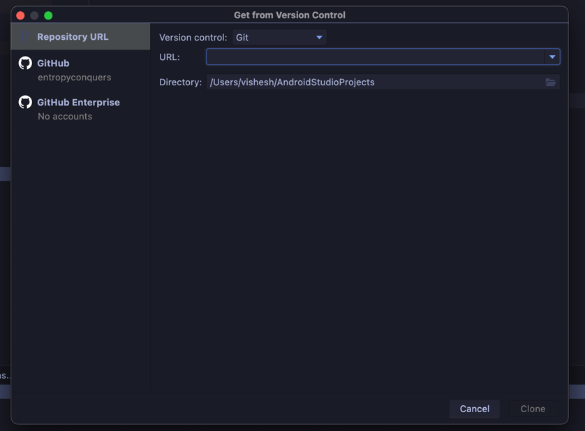

# Tipsy

## Steps to import the project in Android Studio

Click on `File` -> `New` -> `Project from Version Control` -> `Git`

Enter the URL of the repository and click on `Clone`

## Steps to build the project

Click on `Build` -> `Make Project`

## Steps to run the project

Click on `Run` -> `Run 'app'`

## Gradle issues

If you are facing any issues with Gradle, try the following steps:

1. Click on `File` -> `Invalidate Caches / Restart...` -> `Invalidate and Restart`
2. Click on `File` -> `Sync Project with Gradle Files`
3. Click on `Build` -> `Clean Project`
4. Click on `Build` -> `Rebuild Project`
5. Click on `Build` -> `Make Project`
6. Click on `Run` -> `Run 'app'`

